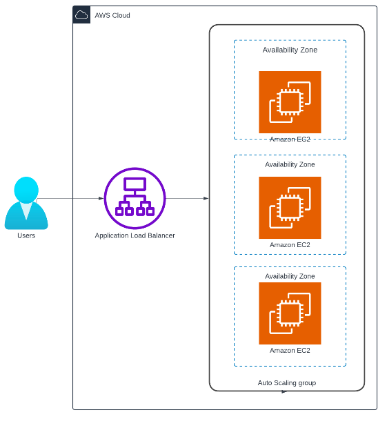

# AWS-ASG-ALB
## Implemented Auto Scaling and Load Balancing for EC2

TThis repository contains code and documentation that demonstrates how an EC2 auto-scaling group can automatically scale EC2 instances and load balancing with Application Load Balancers based on the number of connections made through the ALB, as outlined in this [Medium post](https://medium.com/@mailshraddha8/automatic-scaling-and-load-balancing-with-ec2-and-alb-a0c3de7c1bf8)

 The cloud infrastructure design  can adapt to changes in load at any time. It easily scale in and scale out resources, taking advantage of the scalability and elasticity of the cloud.    

**Setting up the Design:**

  

Start by creating an S3 bucket and store the index.txt file (our sample website) there. Make the S3 bucket public and add a bucket policy to allow access from your account's resources.  
  

Next, create a target group which will contain the EC2 instances created by the Auto Scaling group. 
  

Create an ALB and attach the target group to the ALB.    

  

Then create a launch template which defines the instance type, availaiblity zone of the instance and other instance details. In the user data section, add configuration to pick up the index.txt file from the S3 bucket.   
     

Finally, create an auto scaling group where you define the group size - minimum, maximum and desired capacity. Attach the load balancer and define a scaling policy.   
 

Use the DNS name from the ALB to access the sample website. If you go to the EC2 console, you'll see 2 instances initially. Now try clicking on the website multiple times - you’ll see new instances being created because the scaling policy is set to scale based on ALB requests per target.  

